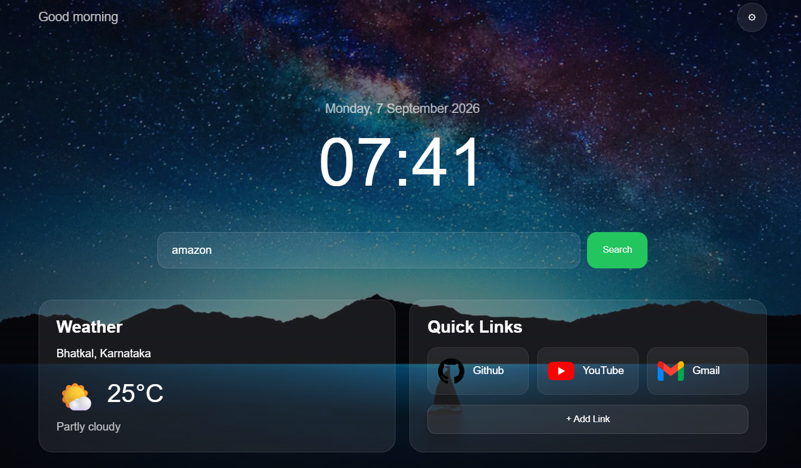
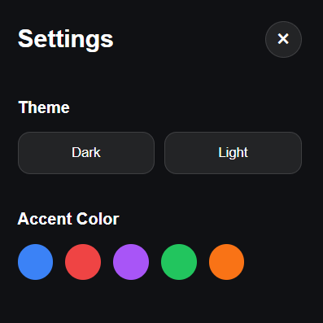

# Pulse Tab

Pulse Tab is a custom new tab page I made for my browser. Instead of the boring default new tab, you get a clock, the date, weather, a search bar, and quick links to sites you use a lot. I leaarned making designs like this in webOS tutorial...Some glassy effects :)

## What it does

**Clock & date** — shows the current time and updates every second, no refresh needed.

**Greeting** — says "Good Morning", "Good Afternoon", "Good Evening" or "Good Night" depending on what time it is.

**Weather** — asks for your location (with permission) and shows the temperature, condition, and an icon for it.

**Search bar** — type something and hit enter, it searches Google for you.

**Keyboard shortcuts**
- `Ctrl + K` or `/` — jumps to the search bar
- `Escape` — closes settings / unfocuses search

**Quick links** — GitHub, YouTube, and Gmail by default. You can add your own tooo, and they got saved so they're still there next time you open a new tab.

**Themes** — dark or light, your choice sticks around after refresh.

**Accent colors** — blue, red, purple, green, orange. Changes the color of buttons/borders/etc.

**Glassy look** — cards have a blurred, translucent background over a wallpaper, kind of a glass effect.

**Little animations** — cards fade in on load, buttons have hover effects, nothing crazy.(I learned this in webOS tutorial:)

**Responsive** — works fine on smaller screens too (columns stack, search bar goes vertical, etc.) -> I made this because I wanted to share this projects to my brothers.....

## How it's built

Everything interactive lives in `src/main.js` — the clock, greeting, weather fetching, search, shortcuts, settings panel, themes/colors, and adding/removing links.

For weather, it uses the browser's built-in geolocation to get your coordinates, then:
- **Open-Meteo** for the actual weather data
- **BigDataCloud** to turn coordinates into a location name

Custom links, theme choice, and accent color are all saved in `localStorage`, so they don't disappear when you close the tab.

Styling is in `src/style.css`. It leans on CSS variables (like `--accent-color`) so changing the accent color in JS updates everything at once instead of having to touch every element.

## Screenshots

### Main Dashboard

### Settings

### Custom Quick Links

