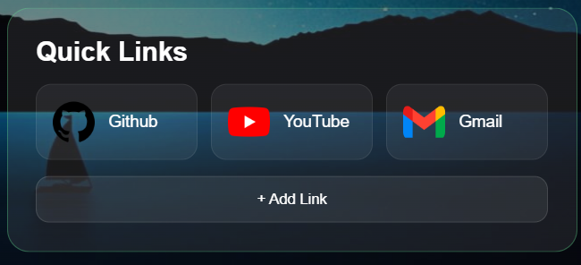

# Pulse Tab

A modern, customizable new tab page built with HTML, CSS, and JavaScript.

Pulse Tab replaces the default browser new tab with a clean dashboard featuring a live clock, weather, search, customizable quick links, themes, accent colors, and smooth animations.

## Screenshots

### Main Dashboard


### Settings


### Custom Quick Links



## Features

* Live clock and date
* Dynamic time-based greeting
* Weather information based on your location
* Automatic location name detection
* Google web search
* `Ctrl + K` and `/` keyboard shortcuts
* Custom quick links
* Add and delete custom links
* Quick links saved with `localStorage`
* Dark and light themes
* Custom accent colors
* Glassmorphism UI
* Smooth page and card animations
* Responsive design for smaller screens
* Settings panel with persistent preferences

## Tech Stack

* HTML5
* CSS3
* JavaScript
* Vite
* Open-Meteo API
* BigDataCloud Reverse Geocoding API
* LocalStorage

## How It Works

### Weather

Pulse Tab requests the user's location through the browser's Geolocation API and uses the coordinates to retrieve current weather information from Open-Meteo.

A reverse geocoding API is also used to convert the coordinates into a readable location name.

### Custom Quick Links

Custom links are stored in the browser's `localStorage`, allowing them to remain available after refreshing the page.

### Themes and Accent Colors

Theme and accent preferences are stored locally so your selected appearance remains after reopening or refreshing the page.

## Getting Started

Clone the repository:

```bash
git clone https://github.com/shaazumer066-bot/pulse-tab.git
```

Enter the project directory:

```bash
cd pulse-tab
```

Install dependencies:

```bash
npm install
```

Start the development server:

```bash
npm run dev
```

Open the local URL shown by Vite in your browser.

## Project Structure

```text
pulse-tab/
├── public/
│   └── images/
│       ├── github.png
│       ├── youtube.png
│       ├── gmail.png
│       └── walpaper.jpg
├── screenshots/
│   ├── Screenshot 2026-09-07 074149.png
│   ├── Screenshot 2026-09-07 074306.png
│   └── Screenshot 2026-09-07 074331.png
├── src/
│   ├── main.js
│   └── style.css
├── .gitignore
├── index.html
├── package-lock.json
├── package.json
└── README.md
```

## Project Goals

Pulse Tab was built as a custom new tab experience focused on combining useful browser features with a clean and customizable interface.

The project was developed incrementally, with each feature tested and committed separately.

## Future Improvements

Possible future improvements include:

* More customization options
* Additional widgets
* More quick-link controls
* Better mobile layouts
* More personalization options
